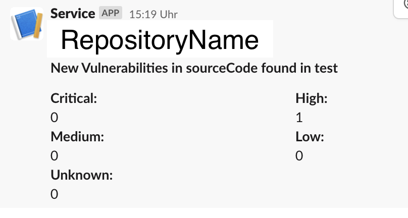
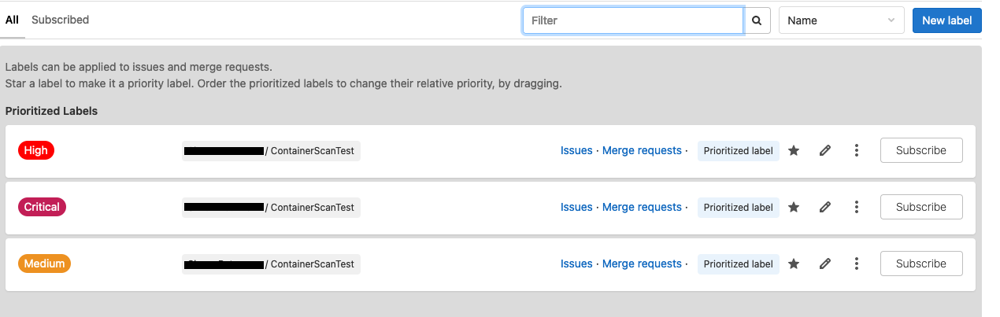
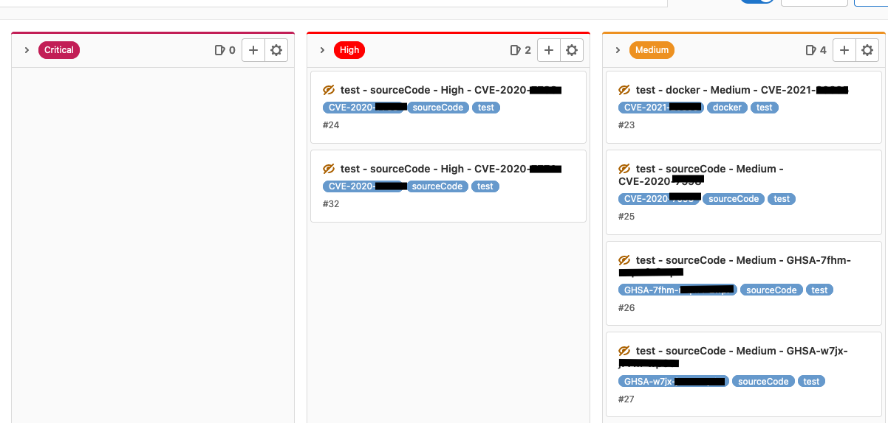
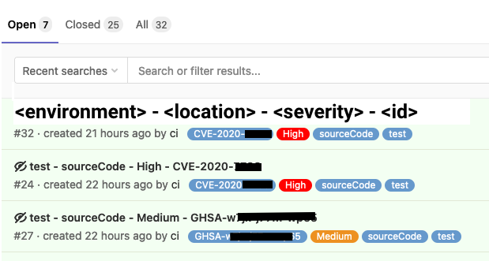
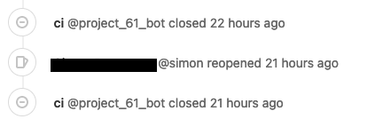

# CSI - Red Alert
Codeflix GmbH would like to share this tool with you, which enables you to make your software more secure.

Use this tool in your release cycle and use it for monitoring/alerting. Everyone benefits from secure software.
Be easily informed about new security vulnerabilities on a daily basis.

Start today with **C**ontinous **S**ecurity **I**ncident **Red** **Alert**ing for your production and development environment.
## Features
What this tool does:
1. Scan Docker image and/ or repository with trivy
2. Create Gitlab issues automatically
    1. Check if trivy marked vulnerability as fixable 
    2. Checks Gitlab for open issues
    3. Create new issue if no issue matching is open
3. Notify on Slack with a short summary about newly introduced vulnerabilities, which are fixable by an upgrade
4. Auto close issues if CVE for an environment is no longer present in the results.


## License
CSI Red Alert is licensed under the GNU Affero General Public License version 3.

## Disclaimer
Codeflix GmbH is not liable for third party content, tools or links available.

## Example
### Slack notifications
Get notified on Slack via a Webhook Token about newly introduced vulnerabilities (managed through Gitlab Issues) for each component and environment.



### Priorize labels, assign colors. Subscribe to labels.
You can also differentiate between the environments.



### Organize vulnerabilities through their severity in a Kanban style


### Filter for issues, environments and more


### Automatic issue closing on implementation
The tool also handles automatic issue closing. If issue was closed but not resolved a new issue is created.



## Supported Docker images and programming languages
Please refer to [https://github.com/aquasecurity/trivy][trivy] for supported Docker images and programming languages.

## Gitlab Integration

Run the investigation pipeline every day, to keep up to date with all known common vulnerabilities.
Based on the awesome scanning tool [trivy](https://github.com/aquasecurity/trivy).

Just create a Slack webhook token and an Gitlab access token to access the API. Provide it to the example below and you are ready to go.
```
stages:
  - build
  - security

build:
 image: docker:stable
 stage: build
 script: 
  - docker build .
  - ....
  
include:
  - 'https://raw.githubusercontent.com/codeflixde/csi-red-alert/main/container-scanning.gitlab-ci.yml'
  - 'https://raw.githubusercontent.com/codeflixde/csi-red-alert/main/repository-scanning.gitlab-ci.yml'

repository-scanning:
  variables:
    ENVIRONMENT: C-137
    SLACK_TOKEN: <optional notification webhook token>
    ISSUE_ACCESS_TOKEN: <gitlab api-token to create an issue>
  stage: security
  only:
    - master
    - schedules
  extends: .repository-scanning

container-scanning:
  stage: security
  variables:
    FULL_IMAGE_NAME: "$CI_REGISTRY_IMAGE:$CI_COMMIT_REF_SLUG"
    ENVIRONMENT: C-137
    SLACK_TOKEN: <optional notification webhook token>
    ISSUE_ACCESS_TOKEN: <gitlab api-token to create an issue>
  only:
    - master
    - schedules
  extends: .container-scanning

```

[trivy]: https://github.com/aquasecurity/trivy
